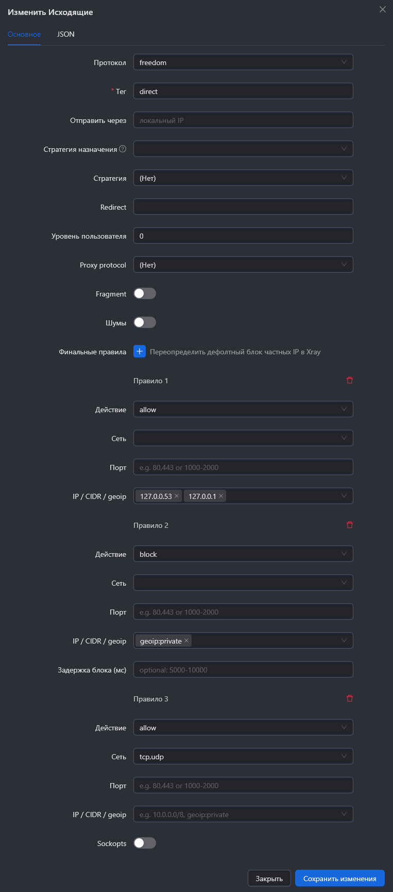
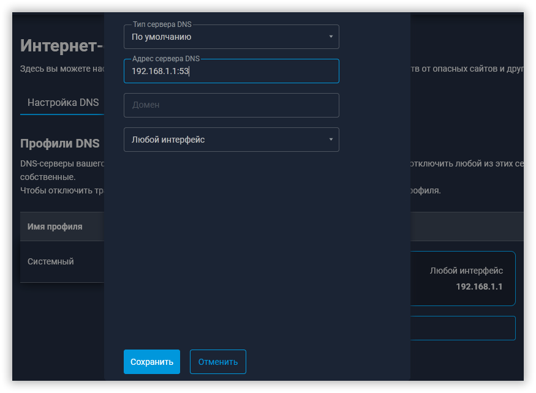

# DNS-over-VLESS — направляем DNS-трафик через прокси xray

> Полная версия статьи: [jameszero.net/3473.htm](https://jameszero.net/4773.htm)

## Предварительные условия

У вас уже должен быть настроен и функционировать личный прокси-сервер xray.

**Замечание от пользователя:**

> Во многих конфигурациях по настройки серверов xray есть секция для предотвращения проблем с локальной маршрутизацией, в ней блокируется "geoip:private", куда попадает дефолтный адрес DNS-резолвера - 127.0.0.53. Для нашей задачи данное правило необходимо удалить, либо направить 127.0.0.53 выше этого правила в директ.

## Структура конфигурации

Разобьём единый файл настроек xray **config.json** на файлы по разделам: **inbounds.json**, **outbounds.json**, **routing.json**, **dns.json**. Этих четырёх файлов достаточно для нашей задачи.

## Конфигурационные файлы

### inbounds.json

```json
{
  "inbounds": [
    {
      "protocol": "tunnel",
      "port": 53,
      "settings": {
        "allowedNetwork": "tcp,udp",
      },
      "tag": "dns"
    },
    {
      "protocol": "tunnel",
      "port": 1181,
      "settings": {
        "allowedNetwork": "tcp,udp",
        "followRedirect": true
      },
      "sniffing": {
        "enabled": true,
        "routeOnly": true,
        "destOverride": ["http","tls","quic"]
      },
      "streamSettings": {
        "sockopt": {"tproxy": "tproxy"}
      },
      "tag": "tproxy"
    }
  ]
}
```

Примечание: в инструкции используются параметры для актуального ядра Xray-core: `"protocol": "tunnel"`, `"allowedNetwork": "tcp,udp"`. Если используете старое ядро, замените их на совместимые: `"protocol": "dokodemo-door"`, `"network": "tcp,udp"`.

### outbounds.json

```json
{
  "outbounds": [
    {
      "protocol": "vless",
      "settings": {
        "address": "***.***.***.***",
        "port": 443,
        "id": "****************************",
        "encryption": "none",
        "flow": "xtls-rprx-vision"
      },
      "streamSettings": {
        "network": "tcp",
        "security": "reality",
        "realitySettings": {
          "serverName": "*********",
          "publicKey": "****************************",
          "shortId": "********",
          "spiderX": "/"
        },
        "sockopt": {
          "domainStrategy": "ForceIP"
        }
      },
      "tag": "proxy"
    },
    {
      "protocol": "freedom",
      "streamSettings": {
        "sockopt": {
          "domainStrategy": "ForceIP"
        }
      },
      "tag": "direct"
    },
    {
      "protocol": "dns",
      "tag": "dns-out"
    }
  ]
}
```

### routing.json

```json
{
  "routing": {
    "rules": [
      {
        "inboundTag": ["dns-in"],
        "outboundTag": "proxy"
      },
      {
        "port": 53,
        "outboundTag": "dns-out"
      },
      {
        "domain": [
          "browserleaks",
          "ip.me"
        ],
        "outboundTag": "proxy"
      },
      {
        "network": "tcp,udp",
        "outboundTag": "direct"
      }
    ]
  }
}
```

### dns.json

В файле `dns.json` не станем разделять DNS-запросы на разные сервера, а направим их непосредственно на прокси-сервер внутри VLESS потока, опытные пользователи могут самостоятельно разделить их при необходимости. В объекте `hosts` привяжите домен вашего прокси-сервера к его IP, это не всегда обязательно, но настоятельно рекомендуется:

```json
{
  "dns": {
    "hosts": {
      "your_proxy_domain.com": "123.123.123.123"
    },
    "servers": [
      "127.0.0.53"
    ],
    "queryStrategy": "UseIP",
    "tag": "dns-in"
  }
}
```

Если у вас на сервере установлен xray версии 26.5.3 или новее, то по умолчанию он блокирует приватные адреса в исходящем direct-подключении и необходимо правильно настроить `finalRules`. Для панели `3x-ui` это можно сделать так:



Если используете "голое" ядро, то так:

```json
{
  "protocol": "freedom",
  "settings": {
    "finalRules": [
      {
        "action": "allow",
        "ip": [
          "127.0.0.53",
          "127.0.0.1"
        ]
      },
      {
        "action": "block",
        "ip": [
          "geoip:private"
        ]
      },
      {
        "action": "allow",
        "network": "tcp,udp"
      }
    ]
  },
  "tag": "direct"
}
```

Поясниение: в `finalRules` разрешаем трафик для `127.0.0.53` и `127.0.0.1`, а затем для всех остальных приватных адресов делаем запрет и разрешаем трафик на внешние IP. Главное помните, что это настройка для сервера, не делайте её в роутере.

## Настройка роутера

Переходим в CLI роутера по ссылке `http://192.168.1.1/a`, отключаем DNS-сервер Кинетика первой командой и сохраняем настройку второй командой:

```
opkg dns-override
system configuration save
```

На этом этапе у вас отключится интернет, не пугайтесь. Если что-то пойдёт не так, отменить изменения можно следующими командами:

```
no opkg dns-override
system configuration save
```

Прописываем в "Интернет фильтрах" KeeneticOS один единственный DNS-сервер - локальный IP-адрес самого роутера с обязательным указанием 53-порта.



Для ядра `Mihomo` настройка DNS-over-VLESS может быть выполнена следующим кодом в конфиге:

```yaml
hosts:
  your_proxy_domain.com: 123.123.123.123

dns:
  enable: true
  listen: 0.0.0.0:53
  nameserver: 
    - 127.0.0.53#PROXY

proxy-groups:
  - name: PROXY
    type: select
    proxies:
      - 'VLESS'
```

## Результат

Запускаем или перезапускаем XKeen. Интернет должен появиться и DNS-запросы теперь обрабатываются вашим прокси-сервером.
