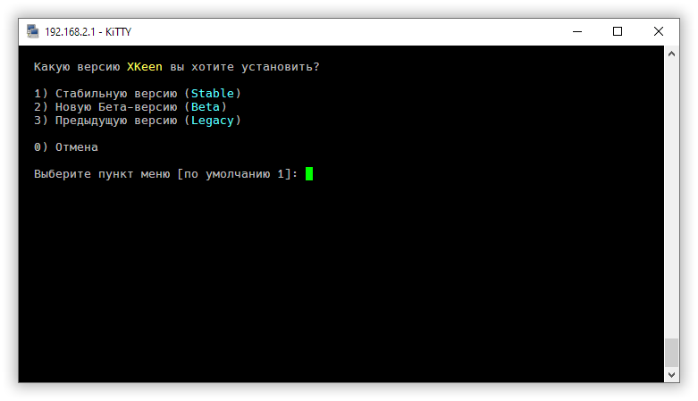
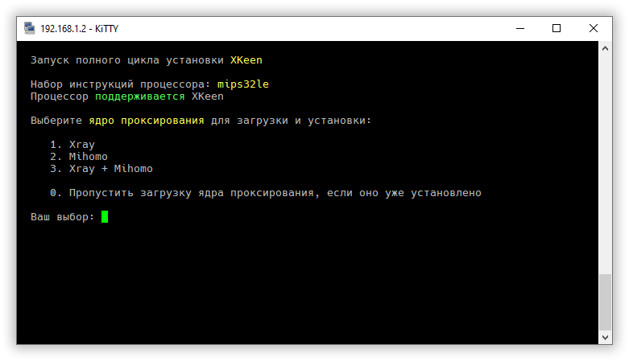
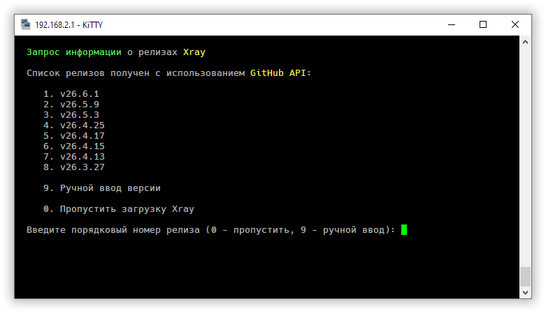
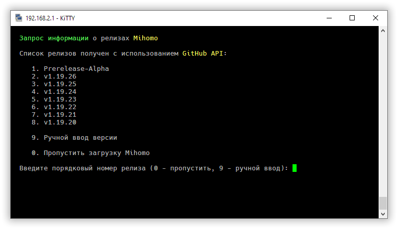
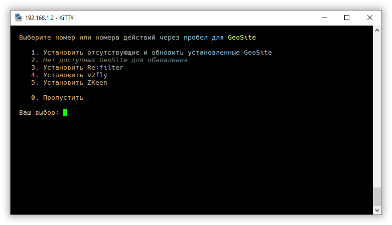
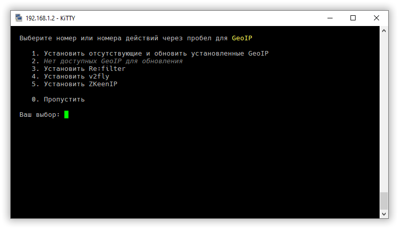
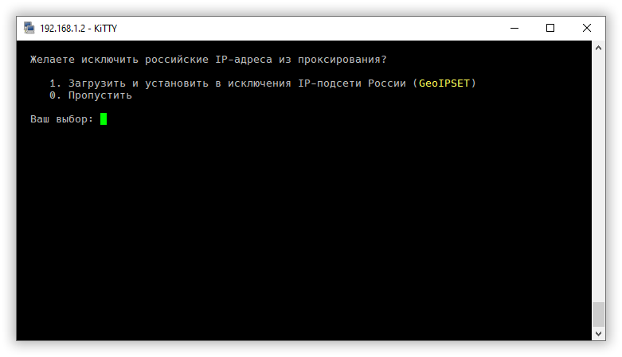
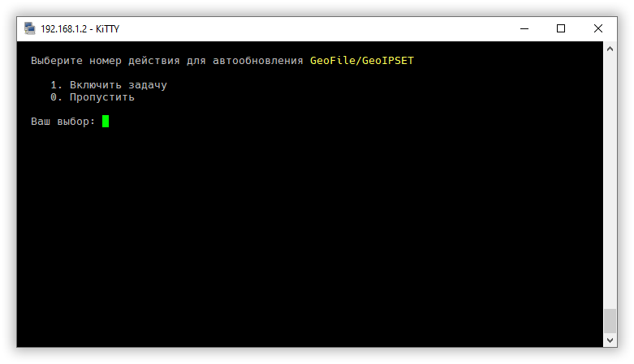
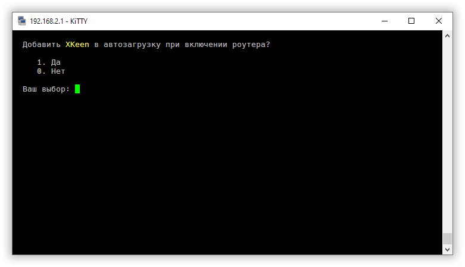
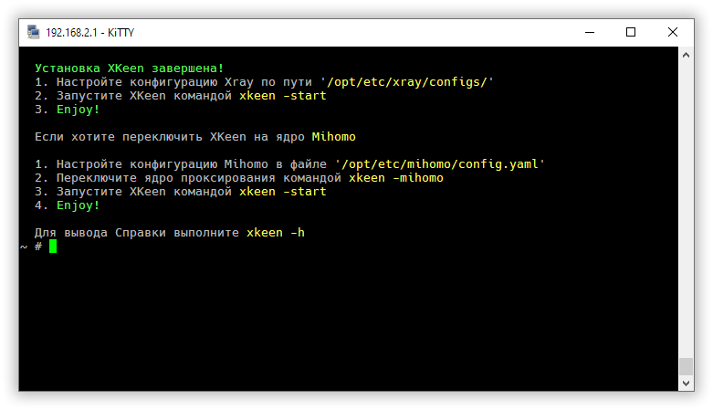

Для установки XKeen требуется [роутер Keenetic](Routers-Info) с установленной средой [Entware](https://support.netcraze.ru/giga/nc-1012/ru/20980-installing-the-entware-repository-on-a-usb-drive.html) и прописанными [шифрованными DNS](https://support.keenetic.ru/ultra/kn-1811/ru/31543-dot-and-doh-proxy-servers-for-dns-requests-encryption.html).
Если планируете использовать XKeen в режиме TProxy или проксирование по [61 DSCP-метке](Маршрутизация-по-DSCP#dscp-61-принудительное-проксирование-через-отдельный-inboundlistener), то в настройках доступа к веб-интерфейсу перенесите 443 порт на другой. Для обычного режима Hybrid это не требуется. Исключение: если для DSCP 61 в Hybrid вы используете отдельный force `tproxy` inbound на `443`, этот порт тоже должен быть свободен.

Выполните в ssh-консоли роутера следующие команды

```
opkg update && opkg upgrade && opkg install curl tar && cd /tmp
sh -c "$(curl -sSL https://raw.githubusercontent.com/jameszeroX/XKeen/main/install.sh)"
```
либо:
```bash
opkg update && opkg upgrade && opkg install curl tar && cd /tmp
sh -c "$(curl -sSL https://cdn.jsdelivr.net/gh/jameszeroX/XKeen@main/install.sh)"
```

Затем выберите интересующую версию, чтобы начать установку



На следующем экране выберите ядро или ядра-проксирования, которые планируете использовать



Установите ядра-проксирования, выбрав их версии из списка, либо введя вручную в пункте `9`





Если установили ядро Xray, то выберите требуемые GeoSite для него. Несколько вариантов можно указать через пробел либо установить все, выбрав `1`



Аналогично для GeoIP



Определитесь, требуется ли исключать из проксирования российские IP-подсети



Если необходимо, включите автообновление Geo-файлов и выберите день и время для этого задания



Добавьте XKeen в автозагрузку при включении роутера, если требуется



Установка завершена. Настройте конфигурационные файлы и запустите проксирование командой `xkeen -start`



Для создания конфигурационных файлов можете использовать различные генераторы в интернете, но лучше, разобравшись с документацией ядер, составить файлы вручную. Это убережет от многих возможных ошибок и научит корректировать настройки при необходимости.

Для использования ядра Xray необходимо сконфигурировать два файла, которые находятся в директории `/opt/etc/xray/config/`

- `04_outbounds.json` - файл с настройками подключения к серверу
- `05_routing.json` - файл с настройками выборочной маршрутизации

По умолчанию XKeen настроен на работу в [режиме](XKeen-modes) `Hybrid`. Если необходимо переключить его в режим чистого `TProxy`, замените следующий файл конфигурации Xray

- [03_inbounds.json](https://github.com/jameszeroX/XKeen/releases/download/2.0_Beta/03_inbounds.json) - файл, переключающий режим на `TProxy`

Для ядра Mihomo необходимо сконфигурировать один файл `config.yaml` в директории `/opt/etc/mihomo/` по инструкциями в интернете или используя генераторы

Известные генераторы конфигурационных файлов:
- https://zxc-rv.github.io/XKeen-UI/Outbound_Generator/
- https://xray-routing-generator.netlify.app

Базовый конфигурационный файл Mihomo:
- https://github.com/zxc-rv/assets/blob/main/config_templates/mihomo/config.yaml

